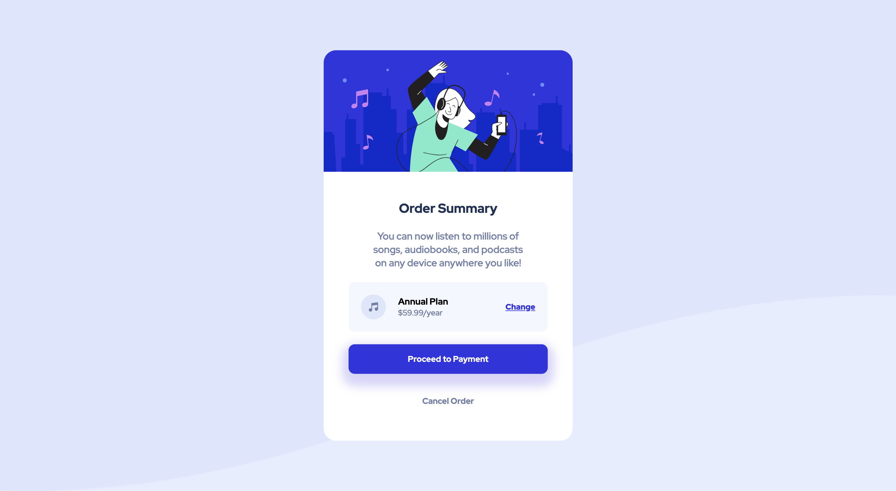

# Frontend Mentor - Order summary card solution

This is a solution to the [Order summary card challenge on Frontend Mentor](https://www.frontendmentor.io/challenges/order-summary-component-QlPmajDUj). Frontend Mentor challenges help you improve your coding skills by building realistic projects. 

## Table of contents

- [Overview](#overview)
  - [The challenge](#the-challenge)
  - [Screenshot](#screenshot)
  - [Links](#links)
- [My process](#my-process)
  - [Built with](#built-with)
  - [What I learned](#what-i-learned)
- [Author](#author)

## Overview

### The challenge

Users should be able to:

- See hover states for interactive elements

### Screenshot

### Links

- Live Site URL: (https://order-summary-component-spowell0162.pages.dev/)

## My process

### Built with

- Flexbox
- CSS Grid

### What I learned

From doing my first Frontend Mentor project, I learned to put more focus on optimising for mobile. My final design is static and the mobile version simply halves many of the elemnts' sizings. For my next on I will focus more on responsiveness.

## Author

- Website - [Samuel Powell](https://samuelpowell.ie/)
- Frontend Mentor - [@spowell0162](https://www.frontendmentor.io/profile/spowell0162)